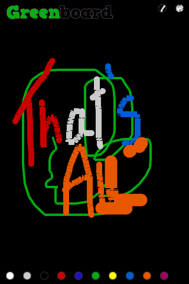
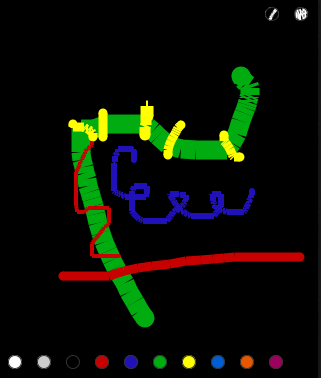
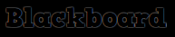

Blackboard
==========

Como criar um aplicativo, uma lousa, para o Firefox OS.
How to create an application, a blackboard, to Firefox OS.

Blackboard is in [Firefox Marketplace](https://marketplace.firefox.com/app/paint-blackboard) and the source code [in this repository in GitHub](https://github.com/nicholascamp/Blackboard). This document is available too in [portuguese](README.md) and in .pdf([english](http://nicholascamp.com.br/blackboard/Blackboard-en.pdf), [portuguese](http://nicholascamp.com.br/blackboard/Blackboard.pdf)).

## SUMMARY

[Introduction](#introduction)

[1. First Steps](#1-first-steps)

[2. Environment organization](#2-environment-organization)

[3. Developing Blackboard](#3-developing-blackboard)

[Conclusion](#conclusion)

[References](#referÊncias)

## Introduction

Firefox OS is a new Operational System developed by Mozilla & his developers community for mobile devices. It's based in Mozilla Firefox browser and in free and open source technologies, as HTML, CSS, JavaScript and Linux.

Have your application in multiples operational systems used to be hard-working. Each one of they have your own language – Java in Android, Objective C in iOS. This way, for native applications creation, was also necessary to think in how portabilize the code for other platforms. The Firefox OS paradigm shows the web as platform, this way, applications need to be installed in the device from itself. They are known as open web apps.

This work treat to explain how to registering an application in Firefox Marketplace step by step, describing all the process until this stage: from the resources used (front-end framework, used to start codification, and fonts) to the code written.

## 1. First steps

Before start to develop an application, it's necessary to have an idea of what would like to be done. This idea can arrive observing the operation of others applications, looking for features not available in the device, in a shower or during a talk.

Having the idea, goes to the development step. Applications for Firefox OS are made like pages of the web: with HTML (Hyper Text Markup Language) for markup, CSS (Cascading Style Sheets) for styles e JS (JavaScript) for manipulation.

These are the languages needed to “talk” to develop applications for Firefox OS and for the web. This work aims to walk through the steps of the development of an application, in this case Blackboard.

## 2. Environment organization

As applications for Firefox OS are made using HTML, CSS and JS, a template is used to base the application and avoid code repetition in each project. The [HTML5 Boilerplate](http://www.html5boilerplate.com/) can be used. It's the same base which many front-end developers (one who works with HTML, CSS and JS – which manipulate the interface) use for develop sites.

Opening the model, the following structure is seen:

The doc folder can be deleted, it contains manual of the HTML5 Boilerplate framework, which is not required by the application. In folders css, img e js will be, respectively, the CSS, images and JS. Blackboard will also not use 404.html,  apple-touch-icon-precomposed.png, CHANGELOG.md, CONTRIBUTING.md, crossdomain.xml, LICENSE.md, README.md e robots.txt; can be deleted. Files in js folder can be deleted too – all the code will be written from beginning. In CSS folder, copy the content of the normalize.css (used to provide rendering consistency to elements between browsers. Similarly CSS's reset) file and past into the beginning  of main.css file. This way one less requisition is loaded (they are expensive for the browser[1](https://stackoverflow.com/questions/9855545/http-requests-vs-file-size)).

Done, open index.html with a code editor. The author uses [Sublime Text 3](http://www.sublimetext.com/3). Remove the `if` from `html` tag. They are necessary only to developing for Internet Explorer, which isn't the case. Leave just the `<html>` tag. The references to normalize and modernizr aren't necessary –	 normalize was aggregated to main.css and modernizr, used to detect features from browsers, will not be used.

Define the `<title>` tag as Blackboard and erase all the content inside `body`. The page looks like this:

		<!DOCTYPE html>
		<html>
			<head>
				<meta charset="utf-8">
				<title>Blackboard</title>
				<meta name="description" content="">
				<meta name="viewport" content="width=device-width, initial-scale=1">

				<link rel="stylesheet" href="css/main.css">
			</head>
			<body></body>
		</html>

Now, for transform the package into an application for Firefox OS, simply create, in the root of the project, aside index.html, the manifest.webapp, with the following content:

		{
		  "name": "Blackboard",
		  "description": "Paint the board",
		  "launch_path": "/index.html",
		  "icons": {
		    "128": "/img/icon-128.png"
		  },
		  "developer": {
		    "name": "Nicholas Camp Barcellos",
		    "url": "http://nicholascamp.com.br"
		  },
		  "default_locale": "en"
		}

This file specifies the information of the application and author. Like name, description, icon and contact with the developer. This way, has an application. More information and other parameters of specification from App Manifest can be found here: [App manifest](https://developer.mozilla.org/en-US/Apps/Build/Manifest).

From version 26 of Mozilla Firefox browser, it's possible to simulate Firefox OS inside it. For this, just go to settings (≡ icon, in the upper right corner), developer and application manager. There is an option to connect your Firefox OS or run the simulator. In this work, it makes the latter.

Opened the Firefox OS simulator, has the interface of the Operational System, with much parts of the features, like browser, messages, clock, settings. Can be done inclusive application install. For this, go back to the previous window (which opened simulator), click in the tab Apps and add the folder where the application is found. Therefore, the application is installed and your icon appears next to others in simulator:

## 3. Application development

Blackboard have the features of paint it with several colors and change the line thickness. Now treats of develop these features.

Introduce in `body` the tag `canvas`, with `id` and `class` blackboard. `id` for manipulate JavaScript, `class` for the CSS. In HTML5, the tag `canvas` is responsible to render graphics and other images. In Blackboard, it is the board itself.

In the CSS, define `background: #000` to the class blackboard. Has then a blackboard.  Create script called blackboard.js in js folder. Insert in HTML the tag `script` pointing its `src` to the file newly created. Insert in the file the object app, responsible by the organization of the property and methods of the app:

		var app = {
			blackboard: document.getElementById('blackboard'),
			ctx: this.blackboard.getContext('2d'),
			lineColor: '#fff', // default color
			lineThickness: 4,
			ongoingTouches: [], // touches in-progress
			startup: function () {
				app.blackboard.width = window.innerWidth;
				app.blackboard.height = window.innerHeight;

				app.blackboard.addEventListener('touchstart', handleTStart, false);
				// app.blackboard.addEventListener('touchcancel', handleTCancel, false);
				app.blackboard.addEventListener('touchmove', handleTMove, false);
				app.blackboard.addEventListener('touchend', handleTEnd, false);
				app.blackboard.addEventListener('touchleave', handleTEnd, false);
			}
		}

		document.addEventListener('DOMContentLoaded', app.startup);

Was defined the propertie blackboard, which captures the `canvas` tag by `id`. `ctx` defines the 2d context of the blackboard, where is drawn. `OngoingTouches` to register touches and then startup, method of initialization of the app, which defines the width and height of the blackboard to the width and height of the device and add EventListeners of touch (`touchstart`, `touchcancel`, `touchmove`, `touchend` and `touchleave`) to `app.blackboard`. So after the document is loaded (`DomContentLoaded`), executes the `startup` from `app` function.

Now is necessary to define the 3 functions added to the EventListeners of touch, `handleTStart`, `handleTMove` e `handleTEnd`. `handleTStart()`:

	function handleTStart(evt) {
		evt.preventDefault();

		var touches = evt.changedTouches;
		var i = 0;
		var len = touches.length;

		for(; i < len; i++) {
			app.ongoingTouches.push(touches[i]);
			app.ctx.beginPath();
			app.ctx.arc(touches[i].pageX, touches[i].pageY, app.lineThickness, 0, 2*Math.PI, false);  // a circle
			app.ctx.fillStyle = app.lineColor;
			app.ctx.fill();
		}
	}

The first line of the function prevents the default action of the touch (if it were a button, would prevent the page change, or blank form fields, etc). The variable `touches` register by an unique id all the data relative each touche (if the device supports multiple touches, one touch will be created for each touch). The order of the touches, which starts with 0, is stablished according to the contact of each touch simultaneous in screen.

After that has variables `i` and `len`, cached for optimize the performance of the loop `for`. In it, iterates for each `touches`, and, hereafter, the explanation of each line of the loop:

1. is added to `app.ongoingTouches` the touch object concerned (which contain all of your information);
2. `beginPath()` creates a new path to be drawn;
3. `arc()` creates an arc, in case, a circle: the first parameter represents the x point where the arc will start to be traced, the second, the point y, the third, the radius, the fourth, the initial angle, the fifth, the final angle and, finally, the sixth, boolean relative to the clock hands -- anticlockwise, true, clockwise, false;
4. `fillStyle` is used to determine a color for the path;
5. And `fill()` is used to fill the path area.

This way, when clicking the screen, is drawn white points (though not segmented), which is the color defined in `app.lineColor`:

Terminada `handleTStart()`, para a função `handleTMove()`. Até o laço `for` da função, foi definido o mesmo que em `handleTStart()`, portanto, para breviedade, expõe-se somente o conteúdo dentro do `for`:

	var idx = ongoingTouchIndexById(touches[i].identifier);

	// There's a touch?
	if(idx >= 0) {
		app.ctx.beginPath();
		app.ctx.moveTo(app.ongoingTouches[idx].pageX, app.ongoingTouches[idx].pageY);
		app.ctx.lineTo(touches[i].pageX, touches[i].pageY);
		app.ctx.lineWidth = app.lineThickness;
		app.ctx.strokeStyle = app.lineColor;
		app.ctx.stroke();

		app.ongoingTouches.splice(idx, 1, touches[i]);  // swap in the new touch record
	}

Outside the function scope, `ongoingTouchIndexById()`, function used by `idx`:

	function ongoingTouchIndexById(idToFind) {
		var i = 0;
		var len = app.ongoingTouches.length;

		for(; i < len; i++) {
			var id = app.ongoingTouches[i].identifier;

			if (id == idToFind) {
				return i;
			}
		}
		return -1; // not found
	}

The function `ongoingTouchIndexById()` captures the unique id from touch in question (`idToFind`) to abstract your information, which are stored in `app.ongoingTouches`, being stored in `idx` variable. As it is an array, starts from 0, that's why the `if >= 0` verification. So has:

1. the path start;
2. the movement of the finger represented by `moveTo()` method, which asks axis x and y;
3. `lineTo()`, which asks the same x and y axis, in other words, it's done a line from the initial point to the actual;
4. `lineThickness()`, which defines a width to the line;
5. `strokeStyle()`, which defines the fill color;
6. `stroke()`, which fills the line with the defined style;
7. the `splice()` method, which swap the previous idx point for the new touches[i].

The `handleTEnd()` function have too the same begin from the previous; differs the for content:

	var idx = ongoingTouchIndexById(touches[i].identifier);

	// There's a touch?
	if(idx >= 0) {
		app.ctx.beginPath();
		app.ctx.moveTo(app.ongoingTouches[idx].pageX, app.ongoingTouches[idx].pageY);
		app.ctx.lineTo(touches[i].pageX, touches[i].pageY);
		app.ctx.arc(touches[i].pageX, touches[i].pageY, app.lineThickness / 2, 0, 2 * Math.PI, false);
		app.ctx.fillStyle = app.lineColor;
		app.ctx.fill();
		app.ongoingTouches.splice(idx, 1);  // remove it; we're done
	}

`idx` captures the id of touch. Past the `if`, has the start of path, has the moving and the line until the point, the arc (circle, as defined in `handleTStart()`), filling it with the defined color, and then, the removal of the point with `splice()`.

Now is possible to drawn continually in the blackboard!

The next step is add colors to Blackboard. Add inside `body` a list with the attribute `data-color` with the colors you choose:

	<ul id="colors" class="colors">
		<li data-color="#FFFFFF"></li>
		<li data-color="#CCCCCC"></li>
		<li data-color="#000000"></li>
		<li data-color="#C90000"></li>
		<li data-color="#2111B9"></li>
		<li data-color="#01AC11"></li>
		<li data-color="#FFFF00"></li>
		<li data-color="#005ED2"></li>
		<li data-color="#E65700"></li>
		<li data-color="#9E005D"></li>
		<!-- <li class="more-colors">+</li> -->
	</ul>

To stylize it:

	.colors { bottom: 3%; left: 3%; margin: 0 0 -5px -5px; padding: 0; position: absolute; }
		.colors li { border: 1px solid #666; border-radius: 50%; cursor: pointer; display: inline-block; height: 12px; margin: 5px; width: 12px; }

This way has rounded icons side by side in the bottom of Blackboard. Add to `app.startup` the call to the function `colors()`, defined hereafter:

	function colors() {
		var colors = document.getElementById('colors');
		var li = colors.getElementsByTagName('li');
		var i = 0;
		var len = li.length;

		for(; i < len; i++) {
			var color = li[i].getAttribute('data-color');
			li[i].style.backgroundColor = color;
		}

		colors.addEventListener('click', function (evt) {
			var color = evt.target.getAttribute('data-color');
			app.lineColor = color;
		});
	}

Is made reference to the colors list in the two first variables, iterates over each one in the loop, where captures the attribute `data-color` from `li`, and adds it to `backgroundColor`. Outside the loop, an click EventListener is added to the list, where captures the attribute `data-color` of the clicked object and assign it to line color.

Cool, isn't it? Now is possible to change line color.

Blackboard is almost done, is left the line thickness feature. For this, is added the unordered list element, `ul`, to the document:

	<ul class="line-thickness">
		<li id="thinner-line" class="thinner-line"></li>
		<li id="thicker-line" class="thicker-line"></li>
	</ul>

And CSS, to position it in the right upper edge:

	.colors { bottom: 3%; left: 3%; margin: 0 0 -12px -5px; padding: 0; position: absolute; }
		.colors li, .line-thickness li { border: 1px solid #333; border-radius: 50%; cursor: pointer; display: inline-block; height: 12px; margin: 5px; width: 12px; }

	.line-thickness { margin: -7px -5px 0 0; padding: 0; position: absolute; right: 3%; top: 3%; }
		.line-thickness li { background: url(../img/line-thickness.png); background-size: 24px; }
		.line-thickness .thicker-line { background-position: right 0; }

An image was added to represent the lower and higher dash. The junction of one or more images is called [sprite](http://www.maujor.com/tutorial/css-sprites.php) – serves to economize file requisitions, which are expensive for the browser. Was used background-size to decrease the size of the image in relation to the cize of the circle, 12x12px. This is the image used to represent the lower and higher dash:

")

Now the JavaScript:

	function lineThickness() {
		var plusBtn = document.getElementById('thicker-line');
		var lessBtn = document.getElementById('thinner-line');

		plusBtn.addEventListener('click', function () {
			console.log('+1');
			app.lineThickness += 1;
		});

		lessBtn.addEventListener('click', function () {
			if (app.lineThickness > 1) {
				console.log('-1');
				app.lineThickness -= 1;
			}
		});
	}

It captures the elements of increase and decrease the line thickness and it adds click EventListeners, which increases and decreases the `app.lineThickness` value. Remember to add to app.startup the function call, like with `colors()`.

Ready! Can end here. But can still write the Blackboard name in the upper left corner and, when change the color of the line, change the color name in Blackboard, in other words, changing to white, has written Whiteboard. This way has the active color represented by the board.

For this, needs to add the title Blackboard to document, find a adequate font, embed it in CSS, change the function `colors()` and add the color names to the colors list.

	<h1>Blackboard</h1>

Added the logo to body. Found a good font to represent Blackboard in FontSquirrel: [HVD Comic Serif Pro](http://www.fontsquirrel.com/fonts/HVD-Comic-Serif-Pro). Download only the woff format, free format, used by Firefox. Create a folder named font in the root of the application and add the font to it.

Add the CSS generated to main.css, delete the `src` not used (.eot, .svg, etc) and change the `url` according the folder where is the font:

	@font-face {
		font-family: 'HVD Comic';
		src: url('../font/HVD_Comic_Serif_Pro-webfont.woff') format('woff');
		font-weight: normal;
		font-style: normal;
	}

Add too the CSS for the title:

	h1 { color: #000; font: 30px/1 'HVD Comic', sans-serif; left: 3%; margin: 0; position: absolute; text-shadow: 0 0 1px #ddd; top: 2%; }

Now, add the respective color names to the color list:

	<li data-color="#FFFFFF" data-name="White"></li>
	<li data-color="#CCCCCC" data-name="Grey"></li>
	<li data-color="#000000" data-name="Black"></li>
	<li data-color="#C90000" data-name="Red"></li>
	<li data-color="#2111B9" data-name="Blue"></li>
	<li data-color="#01AC11" data-name="Green"></li>
	<li data-color="#FFFF00" data-name="Yellow"></li>
	<li data-color="#005ED2" data-name="LightBlue"></li>
	<li data-color="#E65700" data-name="Orange"></li>
	<li data-color="#9E005D" data-name="Pink"></li>

In JavaScript it's needed to capture the attribute `data-name` too in the function `colors()` and write it in `span#color-board`, from logo.

	function colors() {
		var colorNameInLogo = document.getElementById('color-board');
		var colors = document.getElementById('colors');
		var li = colors.getElementsByTagName('li');

		var i = 0;
		var len = li.length;

		for(; i < len; i++) {
			var color = li[i].getAttribute('data-color');

			li[i].style.backgroundColor = color;
		}

		colors.addEventListener('click', function (evt) {
			var color = evt.target.getAttribute('data-color');
			var name = evt.target.getAttribute('data-name');

			app.lineColor = color;
			colorNameInLogo.innerHTML = name;
			colorNameInLogo.style.color = color;
		});
	}

Now, when the line color is changed, it's changed too the name of the color in Blackboard logo. The Blackboard still with background color black, but represents, through logo, visual and textually the active line color. Thus, finished the application.

Tip: to save the app using Firefox OS, press both lock and home button simultaneously.

## Conclusão

Firefox OS is an Operational System product of the web, which came to bring the free and open web for mobile devices. Uses, in it and in yours applications, the same technologies of application development used by the web to develop sites. There's no filter, embarrassment, or another language that your application need to pass by, diferently of the concurrent Operational Systems.

How Firefox OS uses free and open technologies, already known by web developers, it's easy to populate it with applications and improve it. The beauty of the Operational System is in its extensionality. Besides the applications be made using free technologies, all the graphic interface is too, therefore it is something easily expansible and customizable.

Was seen in this document that technically is not something of high difficulty develop applications for the OS and even does not require much skill and knowledge in programming. So, just interest and curiosity to develop applications. Later on, could become a great operating system, used in both mobile (watches, glasses, smartphones and tablets), and fixed devices (desktop computers, refrigerators and televisions).

## References

Mozilla Developer Network. Touch events. Available in: [https://developer.mozilla.org/en-US/docs/Web/Guide/Events/Touch_events](https://developer.mozilla.org/en-US/docs/Web/Guide/Events/Touch_events). Access at: 04/12/14.

Mozilla Developer Network. TouchEvent. Available in: [https://developer.mozilla.org/en-US/docs/Web/API/TouchEvent](https://developer.mozilla.org/en-US/docs/Web/API/TouchEvent). Access at: 04/13/14.

Mozilla Developer Network. EventListener. Available in:  [https://developer.mozilla.org/en-US/docs/Web/API/EventListener](https://developer.mozilla.org/en-US/docs/Web/API/EventListener). Access at: 04/14/14.

Mozilla Developer Network. Touch. Available in: [https://developer.mozilla.org/en-US/docs/Web/API/Touch](https://developer.mozilla.org/en-US/docs/Web/API/Touch). Access at: 04/15/14.

Mozilla Developer Network. App manifest. Available in: [https://developer.mozilla.org/en-US/Apps/Build/Manifest](https://developer.mozilla.org/en-US/Apps/Build/Manifest). Access at: 04/16/14.

Mozilla Developer Network. Drawing Shapes. Available in: [https://developer.mozilla.org/en-US/docs/Web/Guide/HTML/Canvas_tutorial/Drawing_shapes](https://developer.mozilla.org/en-US/docs/Web/Guide/HTML/Canvas_tutorial/Drawing_shapes). Access at: 04/17/14.

Font Squirrel. Available in: [http://www.fontsquirrel.com/](http://www.fontsquirrel.com/). Access at: 04/28/14.

[@nicholascamp](http://twitter.com/nicholascamp "Twitter do autor") 2014 @ Fatec