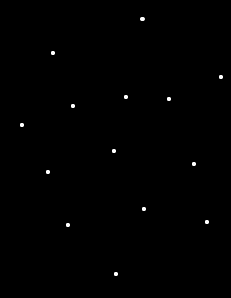

Blackboard
==========

Como criar um aplicativo, uma lousa, para o Firefox OS.

O Blackboard está no [Firefox Marketplace](https://marketplace.firefox.com/app/paint-blackboard) e o código fonte [neste repositório do Github](https://github.com/nicholascamp/Blackboard). Este documento também está disponível em [inglês](README-en.md), em .pdf ([português](http://nicholascamp.com.br/blackboard/Blackboard.pdf), [inglês](http://nicholascamp.com.br/blackboard/Blackboard-en.pdf)) e no [navegador](http://nicholascamp.com.br/blackboard/). Para usar o Blackboard no navegador, habilite o modo responsivo do Firefox (CTRL + SHIFT + M ou equivalente em outro navegador) e clique no botão de simular toques.

## SUMÁRIO

[Introdução](#introduÇÃo)

[1. Primeiros passos](#1-primeiros-passos)

[2. Organização do ambiente](#2-organização-do-ambiente)

[3. Desenvolvendo o Blackboard](#3-desenvolvendo-o-blackboard)

[Conclusão](#conclusÃo)

[Referências](#referÊncias)

## Introdução

O Firefox OS é um novo Sistema Operacional desenvolvido pela Mozilla & sua comunidade de desenvolvedores para dispositivos móveis. É baseado no  navegador Mozilla Firefox e em tecnologias livres e abertas, como HTML, CSS, JavaScript e Linux.

Ter o seu aplicativo em múltiplos sistemas operacionais costumava ser algo trabalhoso. Cada um deles possui sua linguagem – Java no Android, Objective C no iOS. Desta forma, para a criação de aplicativos nativos, era preciso pensar também em como portabilizar o código para as outras plataformas. O paradigma do Firefox OS mostra que a web é a plataforma, sendo assim, aplicativos devem ser instalados no dispositivo a partir dela mesma. São conhecidos como aplicativos da web aberta, open web apps.

Este trabalho trata de explicar como cadastrar um aplicativo no Firefox Marketplace passo a passo, descrevendo todo o processo até esta etapa: desde os recursos utilizados (como um framework de front-end, biblioteca utilizada que facilita o início da codificação e fontes baixadas de “baús” de fontes) até os códigos escritos.

## 1. Primeiros passos

Antes de começar a desenvolver um aplicativo, é necessário ter uma ideia do que gostaria de ser feito. Essa ideia pode vir observando o funcionamento de outros aplicativos, procurando funcionalidades não disponíveis no dispositivo, no banho ou durante uma conversa.

Tendo a ideia, passa-se à etapa de desenvolvimento. Aplicativos para o Firefox OS são feitos assim como páginas da web: com HTML (Hyper Text Markup Language), CSS (Cascading Style Sheets) e JS (JavaScript). HTML é linguagem de marcação de conteúdo, CSS, de estilização, e JS, de manipulação. Além destas, é importantíssimo conhecimento intermediário de inglês.

Essas são as linguagens que precisa-se aprender a “falar” para desenvolver aplicativos para o Firefox OS e para a web. Este trabalho tem como intuito caminhar pelas etapas de desenvolvimento de um aplicativo, neste caso o Blackboard.

## 2. Organização do ambiente

Como aplicativos para o Firefox OS são feitos utilizando HTML, CSS e JS, utiliza-se um modelo, um template, para basear a aplicação e evitar repetição de código a cada novo projeto. Como ainda não há um modelo específico para o Firefox OS, pode-se usar o [HTML5 Boilerplate](http://www.html5boilerplate.com/). É a mesma base que muitos desenvolvedores front-end (aquele que mexe com HTML, CSS e JS – que trabalha a interface) utilizam para desenvolver sites.

Abrindo o modelo, vemos a seguinte estrutura:

A pasta doc pode ser apagada, pois contém manual do modelo HTML5 Boilerplate (não requerido pelo aplicativo). Nas pastas css, img e js ficarão, respectivamente, o CSS, as imagens e o JS. O Blackboard não utilizará os arquivos 404.html, apple-touch-icon-precomposed.png, CHANGELOG.md, CONTRIBUTING.md, crossdomain.xml, LICENSE.md, README.md e robots.txt; podem ser deletados. Juntamente com todos os arquivos da pasta js – o JS será escrito desde o ínicio. Na pasta css, copiar o conteúdo do arquivo normalize.css (serve para dar consistência de renderização aos elementos entre navegadores. Semelhante aos CSS *reset*) e colar no início do main.css. Dessa forma usa-se menos uma requisição, a qual é custosa para o navegador [1](https://stackoverflow.com/questions/9855545/http-requests-vs-file-size).

Feito, abrir a index.html com um editor de código. O autor utiliza o [Sublime Text 3](http://www.sublimetext.com/3). Remover os `if` da tag html — necessários somente ao desenvolvimento para o Internet Explorer. Deixar somente `<html>`. As referências ao normalize e ao modernizr não são necessárias — o normalize foi agregado ao main.css e o modernizr, utilizado para detectar funcionalidades dos navegadores,  não será utilizado.

Definir o `<title>` como Blackboard e apagar todo o conteúdo dentro do `body`. A página está assim:

		<!DOCTYPE html>
		<html>
			<head>
				<meta charset="utf-8">
				<title>Blackboard</title>
				<meta name="description" content="">
				<meta name="viewport" content="width=device-width, initial-scale=1">

				<link rel="stylesheet" href="css/main.css">
			</head>
			<body></body>
		</html>

Agora, para transformar o pacote num aplicativo para o Firefox OS, basta criar, na raiz do projeto, ao lado da index.html, o manifest.webapp:

		{
		  "name": "Blackboard",
		  "description": "Paint the board",
		  "launch_path": "/index.html",
		  "icons": {
		    "128": "/img/icon-128.png"
		  },
		  "developer": {
		    "name": "Nicholas Camp Barcellos",
		    "url": "http://nicholascamp.com.br"
		  },
		  "default_locale": "en"
		}

Este arquivo especifica as informações do aplicativo e do autor, tais como nome, descrição, ícone e contato com o desenvolvedor. Sendo assim, temos um aplicativo. Mais informações e outros parâmetros de especificação do App Manifest podem ser encontrados na página [App manifest](https://developer.mozilla.org/en-US/Apps/Build/Manifest).

A partir da versão 26 do navegador Mozilla Firefox, é possível simular o Firefox OS dentro dele. Para isso, basta ir em configurações (ícone ≡, no canto direito superior), desenvolvedor e gerenciador de aplicativos. Lá há opção de conectar seu Firefox OS ou rodar o simulador. Neste trabalho, faz-se a última opção.

Aberto o simulador do Firefox OS, tem-se a interface do Sistema Operacional, com grande parte de suas funcionalidades, tais como navegador, mensagens, relógio, configurações. Pode-se inclusive fazer a instalação de aplicativos. Para isso, voltar para a janela anterior (que abriu o simulador), clicar na aba Apps e adicionar a pasta aonde se encontra o aplicativo. Assim, o aplicativo é instalado e seu ícone aparece ao lado dos outros no simulador:

## 3. Desenvolvimento do aplicativo

O Blackboard é uma lousa. Suas funcionalidades consistem em pintá-la com diversas cores e mudar a grossura da linha. Agora se trata de desenvolver essas funcionalidades.

Introduzir no `body` a tag `canvas`, com `id` e class `blackboard`. `id` para manipular o JavaScript, `class` para o CSS. Em HTML5, a tag `canvas` é responsável por renderizar gráficos e outras imagens. No Blackboard, é a própria lousa.

No CSS, definir para a classe blackboard `background: #000`. Tem-se então uma lousa preta. Criar script chamado blackboard.js na pasta js. Inserir no HTML a tag `script` e apontar o atributo `src` para o arquivo recém criado. Inserir então no arquivo o objeto app, responsável pela estruturação das propriedades e métodos do aplicativo:

		var app = {
			blackboard: document.getElementById('blackboard'),
			ctx: this.blackboard.getContext('2d'),
			lineColor: '#fff', // default color
			lineThickness: 4,
			ongoingTouches: [], // touches in-progress
			startup: function () {
				app.blackboard.width = window.innerWidth;
				app.blackboard.height = window.innerHeight;

				app.blackboard.addEventListener('touchstart', handleTStart, false);
				// app.blackboard.addEventListener('touchcancel', handleTCancel, false);
				app.blackboard.addEventListener('touchmove', handleTMove, false);
				app.blackboard.addEventListener('touchend', handleTEnd, false);
				app.blackboard.addEventListener('touchleave', handleTEnd, false);
			}
		}

		document.addEventListener('DOMContentLoaded', app.startup);

Foi definido a propriedade `blackboard`, que captura a tag `canvas` pelo `id`. `ctx` define o contexto 2d da lousa, no qual desenha-se. `LineColor` e `lineThickness` definem a cor e a grossura da linha, respectivamente.

`ongoingTouches` para registrar os toques, trabalhado e, em seguida, `startup`, método de inicialização da aplicação, que define a largura e altura da lousa para a largura do dispositivo e adiciona *EventListeners* de toque à `app.blackboard`.

Em JavaScript, manipula-se os eventos de toque — iniciar, cancelar, mover, terminar e deixar — com os *EventListeners* `touchstart`, `touchcancel`, `touchmove`, `touchend` e `touchleave`, respectivamente. Então, depois que o documento estiver carregado (`DOMContentLoaded`), executa-se a função `startup` de `app`.

Agora é necessário definir as 3 funções adicionadas aos eventos de toque, `handleTStart`, `handleTMove` e `handleTEnd`. `handleTStart()`:

	function handleTStart(evt) {
		evt.preventDefault();

		var touches = evt.changedTouches;
		var i = 0;
		var len = touches.length;

		for(; i < len; i++) {
			app.ongoingTouches.push(touches[i]);
			app.ctx.beginPath();
			app.ctx.arc(touches[i].pageX, touches[i].pageY, app.lineThickness, 0, 2*Math.PI, false);  // a circle
			app.ctx.fillStyle = app.lineColor;
			app.ctx.fill();
		}
	}

A primeira linha da função impede a ação padrão do toque (caso fosse um botão, preveniria a mudança de página, ou limpar campos de um formulário, etc). A variável touches registra por meio de um identificador único todos os dados referente a cada toque (se o dispositivo suporta múltiplos toques – múltiplos objetos dentro da variável, que é um array de objetos –, será criado um para cada toque). A ordem dos toques, que começa em 0, é estabelecida de acordo com o contato de cada toque simultâneo na tela.

Após temos as variáveis `i` e `len`, cacheadas para otimizar a performance do laço `for`. Nele, itera-se (inicia e termina o laço, recomeçando-o) por cada `touches`, e, a seguir, a explicação de cada linha deste laço:

1. adiciona-se a `app.ongoingTopuches` o objeto do toque em questão (o qual contém todas suas informações);
2. `beginPath()` cria um novo caminho a ser desenhado;
3. `arc()` cria um arco, no caso, um círculo: o primeiro parâmetro representa o ponto x onde o arco começará a ser traçado, o segundo, o ponto y, o terceiro, o raio, o quarto, o ângulo inicial, o quinto, o ângulo final e, finalmente, o sexto, *boolean* referente ao sentido dos ponteiros do relógio – anti-horário, verdadeiro, horário, falso;
4. `fillStyle` é usado para determinar uma cor para o *path*;
5. E `fill()` é usado para preencher a área do *path*.

Assim, quando clicamos na tela, desenha-se pontos (ainda que não segmentados) brancos (que é a cor definida em `app.lineColor`):

Terminada `handleTStart()`, para a função `handleTMove()`. Até o laço `for` da função, foi definido o mesmo que em `handleTStart()`, portanto, para breviedade, expõe-se somente o conteúdo dentro do `for`:

	var idx = ongoingTouchIndexById(touches[i].identifier);

	// There's a touch?
	if(idx >= 0) {
		app.ctx.beginPath();
		app.ctx.moveTo(app.ongoingTouches[idx].pageX, app.ongoingTouches[idx].pageY);
		app.ctx.lineTo(touches[i].pageX, touches[i].pageY);
		app.ctx.lineWidth = app.lineThickness;
		app.ctx.strokeStyle = app.lineColor;
		app.ctx.stroke();

		app.ongoingTouches.splice(idx, 1, touches[i]);  // swap in the new touch record
	}

Fora do escopo do laço e da função, ongoingTouchIndexById, função usada por idx:

	function ongoingTouchIndexById(idToFind) {
		var i = 0;
		var len = app.ongoingTouches.length;

		for(; i < len; i++) {
			var id = app.ongoingTouches[i].identifier;

			if (id == idToFind) {
				return i;
			}
		}
		return -1; // not found
	}

A função `ongoingTouchIndexById()` captura o idenficador único do *touch* em questão (`idToFind`) para abstrair suas informações, que estão armazenadas em `app.ongoingTouches`, sendo armazenado na variável `idx`. Como é um *array*, inicia do zero, por isso a verificação do `if` >= 0. Então temos:

1. o início do *path*;
2. a movimentação do dedo representada pelo método `moveTo()`, que pede os eixos x e y;
3. `lineTo()`, que pede os mesmos eixos x e y, ou seja, é feita uma linha do ponto anterior até o ponto atual;
4. `lineThickness()`, que define a largura da linha;
5. `strokeStyle()`, que define a cor do preenchimento;
6. `stroke()`, que preenche a linha com a estilo definido;
7. o método `splice()`, que troca o ponto `idx` anterior pelo novo `touches[i]`.

A função `handleTEnd()` também tem o mesmo início das anteriores; difere o conteúdo do `for`:

	var idx = ongoingTouchIndexById(touches[i].identifier);

	// There's a touch?
	if(idx >= 0) {
		app.ctx.beginPath();
		app.ctx.moveTo(app.ongoingTouches[idx].pageX, app.ongoingTouches[idx].pageY);
		app.ctx.lineTo(touches[i].pageX, touches[i].pageY);
		app.ctx.arc(touches[i].pageX, touches[i].pageY, app.lineThickness / 2, 0, 2 * Math.PI, false);
		app.ctx.fillStyle = app.lineColor;
		app.ctx.fill();
		app.ongoingTouches.splice(idx, 1);  // remove it; we're done
	}

`idx` captura o idenficador único do touch em questão, passado o `if`, temos o início do *path*, a movimentação e a linha até o ponto, o arco (círculo, como definido em `handleTStart()`), preenchendo-o com a cor definida, e então, a remoção do ponto com o método `splice()`, fechando o ciclo.

Agora é possível desenhar continuamente na lousa!

A próxima etapa é adicionar cores à Blackboard. Adicione ao `body` uma lista com o atributo `data-color` com as cores que você desejar:

	<ul id="colors" class="colors">
		<li data-color="#FFFFFF"></li>
		<li data-color="#CCCCCC"></li>
		<li data-color="#000000"></li>
		<li data-color="#C90000"></li>
		<li data-color="#2111B9"></li>
		<li data-color="#01AC11"></li>
		<li data-color="#FFFF00"></li>
		<li data-color="#005ED2"></li>
		<li data-color="#E65700"></li>
		<li data-color="#9E005D"></li>
		<!-- <li class="more-colors">+</li> -->
	</ul>

Para estilizá-la:

	.colors { bottom: 3%; left: 3%; margin: 0 0 -5px -5px; padding: 0; position: absolute; }
		.colors li { border: 1px solid #666; border-radius: 50%; cursor: pointer; display: inline-block; height: 12px; margin: 5px; width: 12px; }

Dessa forma temos ícones redondos lado a lado. Adicionar a `app.startup` a chamada à função `colors()`, definida a seguir:

	function colors() {
		var colors = document.getElementById('colors');
		var li = colors.getElementsByTagName('li');
		var i = 0;
		var len = li.length;

		for(; i < len; i++) {
			var color = li[i].getAttribute('data-color');
			li[i].style.backgroundColor = color;
		}

		colors.addEventListener('click', function (evt) {
			var color = evt.target.getAttribute('data-color');
			app.lineColor = color;
		});
	}

Faz-se referência à lista de cores nas duas primeiras variáveis, itera-se sobre cada uma delas no laço, aonde captura-se o atributo `data-color` da `li` e o adiciona ao `backgroundColor`. Fora do laço, adiciona-se um *EventListener* de click à lista, aonde captura-se o atributo `data-color` do objeto clicado e atribui-o à cor da linha.

Legal, não é? Agora é possível mudar a cor do tracejado.

Blackboard está quase pronta, falta adicionar a funcionalidade de mudar a grossura da linha. Para isso, adiciona-se o elemento de lista não ordenada, `ul`, ao documento:

	<ul class="line-thickness">
		<li id="thinner-line" class="thinner-line"></li>
		<li id="thicker-line" class="thicker-line"></li>
	</ul>

E o CSS, para posicioná-lo no canto direito superior:

	.colors { bottom: 3%; left: 3%; margin: 0 0 -12px -5px; padding: 0; position: absolute; }
		.colors li, .line-thickness li { border: 1px solid #333; border-radius: 50%; cursor: pointer; display: inline-block; height: 12px; margin: 5px; width: 12px; }

	.line-thickness { margin: -7px -5px 0 0; padding: 0; position: absolute; right: 3%; top: 3%; }
		.line-thickness li { background: url(../img/line-thickness.png); background-size: 24px; }
		.line-thickness .thicker-line { background-position: right 0; }

Foi adicionado uma imagem para representar o tracejado menor e maior. A junção de uma ou mais imagens em uma chama-se [sprite](http://www.maujor.com/tutorial/css-sprites.php) – serve para economizar requisições de arquivos. Foi utilizado background-size para diminuir o tamanho da imagem em relação ao tamanho do círculo, 12x12px. Esta é a imagem utilizada para representar o tracejado menor e maior, respectivamente:

")

Agora o JavaScript:

	function lineThickness() {
		var plusBtn = document.getElementById('thicker-line');
		var lessBtn = document.getElementById('thinner-line');

		plusBtn.addEventListener('click', function () {
			console.log('+1');
			app.lineThickness += 1;
		});

		lessBtn.addEventListener('click', function () {
			if (app.lineThickness > 1) {
				console.log('-1');
				app.lineThickness -= 1;
			}
		});
	}

Captura-se os elementos de aumentar e diminuir a espessura da linha e adiciona-se *EventListeners* de clique, que aumentam e diminuem o valor de `app.lineThickness`. Lembre-se de adicionar à `app.startup` a chamada à função, como em `colors()`.

Pronto! Pode-se terminar por aqui. Mas pode-se ainda escrever o nome da Blackboard no canto esquerdo superior e, ao mudar a cor da linha, mudar o nome da cor em Blackboard, ou seja, mudando para branco, tem-se escrito Whiteboard. Assim tem-se uma representação da cor ativa da Blackboard.

Para isso, precisamos adicionar o título Blackboard ao documento, buscar uma fonte adequada, embuti-la no CSS, alterar a função `colors()` e adicionar os nomes das cores à lista de cores.

	<h1>Blackboard</h1>

Adicionada a logo ao `body`. Nenhuma fonte padrão do sistema representou bem o Blackboard, então foi buscada uma em FontSquirrel: [HVD Comic Serif Pro](http://www.fontsquirrel.com/fonts/HVD-Comic-Serif-Pro). Baixar somente o formato woff, formato livre, que é usado pelo Firefox. Criar uma pasta chamada font na raiz do aplicativo e adicionar a fonte à ela.

Adicionar o CSS gerado ao main.css, excluir os `src` não utilizados (.eot, .svg, etc) e mudar a `url` de acordo com a pasta aonde se encontra a fonte:

	@font-face {
		font-family: 'HVD Comic';
		src: url('../font/HVD_Comic_Serif_Pro-webfont.woff') format('woff');
		font-weight: normal;
		font-style: normal;
	}

Adicionar também o CSS para o título:

	h1 { color: #000; font: 30px/1 'HVD Comic', sans-serif; left: 3%; margin: 0; position: absolute; text-shadow: 0 0 1px #ddd; top: 2%; }

Agora, adicionar os respectivos nomes das cores à lista de cores:

	<li data-color="#FFFFFF" data-name="White"></li>
	<li data-color="#CCCCCC" data-name="Grey"></li>
	<li data-color="#000000" data-name="Black"></li>
	<li data-color="#C90000" data-name="Red"></li>
	<li data-color="#2111B9" data-name="Blue"></li>
	<li data-color="#01AC11" data-name="Green"></li>
	<li data-color="#FFFF00" data-name="Yellow"></li>
	<li data-color="#005ED2" data-name="LightBlue"></li>
	<li data-color="#E65700" data-name="Orange"></li>
	<li data-color="#9E005D" data-name="Pink"></li>

No JavaScript é preciso capturar também o atributo `data-name` e escrevê-lo no `span#color-board`, da logo. Nova função colors():

	function colors() {
		var colorNameInLogo = document.getElementById('color-board');
		var colors = document.getElementById('colors');
		var li = colors.getElementsByTagName('li');

		var i = 0;
		var len = li.length;

		for(; i < len; i++) {
			var color = li[i].getAttribute('data-color');

			li[i].style.backgroundColor = color;
		}

		colors.addEventListener('click', function (evt) {
			var color = evt.target.getAttribute('data-color');
			var name = evt.target.getAttribute('data-name');

			app.lineColor = color;
			colorNameInLogo.innerHTML = name;
			colorNameInLogo.style.color = color;
		});
	}

Agora, quando a cor da linha é alterada, é alterada também o nome da cor em Blackboard. A Blackboard, independentemente da cor ativa, continua preta, porém representa, por meio da logo, visual e textualmente a cor da linha ativa. Assim, terminamos o aplicativo.

Dica: para salvar o desenho utilizando o Firefox OS, pressione o botão de travar a tela simultaneamente com o botão de início.

## CONCLUSÃO

O Firefox OS é um Sistema Operacional produto da web, que veio trazer a web livre para os dispositivos móveis. Utiliza, em si e em seus aplicativos, as mesmas tecnologias de desenvolvimento de aplicativos que a web utiliza para desenvolver sites. Não há um filtro, um impecílio, uma outra linguagem pela qual o aplicativo tem que passar, diferentemente dos Sistemas Operacionais concorrentes.

Como o Firefox OS utiliza tecnologias livres e abertas, já conhecidas por desenvolvedores web, é fácil populá-lo de aplicativos e melhorá-lo. A beleza do Sistema Operacional se vê em sua extensionalidade. Além dos aplicativos serem feitos utilizando estas tecnologias livres, toda a interface gráfica também é, portanto trata-se de algo facilmente expansível e customizável.

Foi visto neste documento que, tecnicamente, não é algo de dificuldade elevada desenvolver aplicativos para o Sistema Operacional e, inclusive, não requer muita habilidade e conhecimento em programação. Sendo assim, basta interesse e curiosidade para desenvolver aplicativos. Mais pra frente, pode vir a tornar-se um grande Sistema Operacional, utilizado tanto em dispositivos móveis (óculos, celulares e tabletes), quanto nos fixos (computadores de mesa, geladeiras e televisões).

## REFERÊNCIAS

Mozilla Developer Network. Touch events. Disponível em: [https://developer.mozilla.org/en-US/docs/Web/Guide/Events/Touch_events](https://developer.mozilla.org/en-US/docs/Web/Guide/Events/Touch_events). Acesso em: 12/04/14.

Mozilla Developer Network. TouchEvent. Disponível em: [https://developer.mozilla.org/en-US/docs/Web/API/TouchEvent](https://developer.mozilla.org/en-US/docs/Web/API/TouchEvent). Acesso em: 13/04/14

Mozilla Developer Network. EventListener. Disponível em:  [https://developer.mozilla.org/en-US/docs/Web/API/EventListener](https://developer.mozilla.org/en-US/docs/Web/API/EventListener). Acesso em: 14/04/14

Mozilla Developer Network. Touch. Disponível em: [https://developer.mozilla.org/en-US/docs/Web/API/Touch](https://developer.mozilla.org/en-US/docs/Web/API/Touch). Acesso em: 15/04/14

Mozilla Developer Network. App manifest. Disponível em: [https://developer.mozilla.org/en-US/Apps/Build/Manifest](https://developer.mozilla.org/en-US/Apps/Build/Manifest). Acesso em: 16/04/14

Mozilla Developer Network. Drawing Shapes. Disponível em: [https://developer.mozilla.org/en-US/docs/Web/Guide/HTML/Canvas_tutorial/Drawing_shapes](https://developer.mozilla.org/en-US/docs/Web/Guide/HTML/Canvas_tutorial/Drawing_shapes). Acesso em: 17/04/14

Font Squirrel. Disponível em: [http://www.fontsquirrel.com/](http://www.fontsquirrel.com/). Acesso em: 28/04/14

[@nicholascamp](http://twitter.com/nicholascamp "Twitter do autor") 2014 @ Fatec